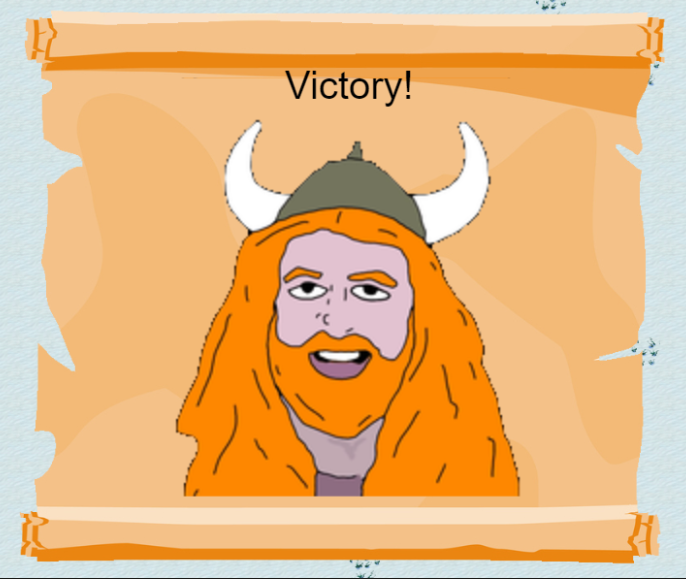

## Objective

The primary goal is to visit Christmas Island and engage with Morcel Nougat to demonstrate prowess in the newly introduced game. The challenge involves teaming up with another player and showcasing effective strategies to defeat Santa.

## Solutions

There are multiple approaches to overcoming this challenge.

#### Solution 1: Dynamic Team Formation

Team up with a randomly assigned player to collaboratively defeat Santa. This dynamic strategy introduces an element of unpredictability, enhancing the challenge.

#### Solution 2: Tactical Cooperation with Jared the Elf

1. Access the game using the following URL: `https://hhc23-snowball.holidayhackchallenge.com/room/?username=dibsyhex&roomId=8a1dcd74&roomType=public&gameType=co-op&id=6919e241-4bdb-4166-ad77-59ef1da4d19f&dna=...&singlePlayer=false`.
2. Modify the parameter `singlePlayer=false` to `singlePlayer=true` to initiate a cooperative game with an Elf the Dwarf.
3. Utilize the browser's developer console to set the player's health to a higher value (`player.health=999;`) for enhanced durability during the encounter with Santa.

#### Solution 3: Auto Kill Enabled Strategy

1. Create and join a new room.
2. Open an incognito window to create another user with the same link, modifying the ID value by a singe character to make it unique.
3. Execute the provided JavaScript code in both developer consoles.
4. The code sends WebSocket message indicating the hits of Elves and Santa,fooling the backend :) 
5. Observe as all elves are automatically defeated, and Santa's health is systematically reduced. Emphasizing a non-violent approach, this strategy seeks to minimize direct player involvement in combat.

```Javascript
function godMode(){
	player.health=999;
}

function defeat_elves(){
	keysArray = Object.keys(allElves);

	for(i=0;i<keysArray.length;i++){
    		elf_id = keysArray[i]

	data = {
		"a": "e",
		"i": player.playerId,
		"eid": elf_id
	}
	ws.send(JSON.stringify(data))
	}
}

function defeat_santa(){

	data = {
		"a": "s",
		"i": player.playerId,
	}
	ws.send(JSON.stringify(data))

}


function autoPlay(){
	godMode();
	defeat_elves();
	defeat_santa();
}

const intervalId = setInterval(autoPlay, 1000);
```


